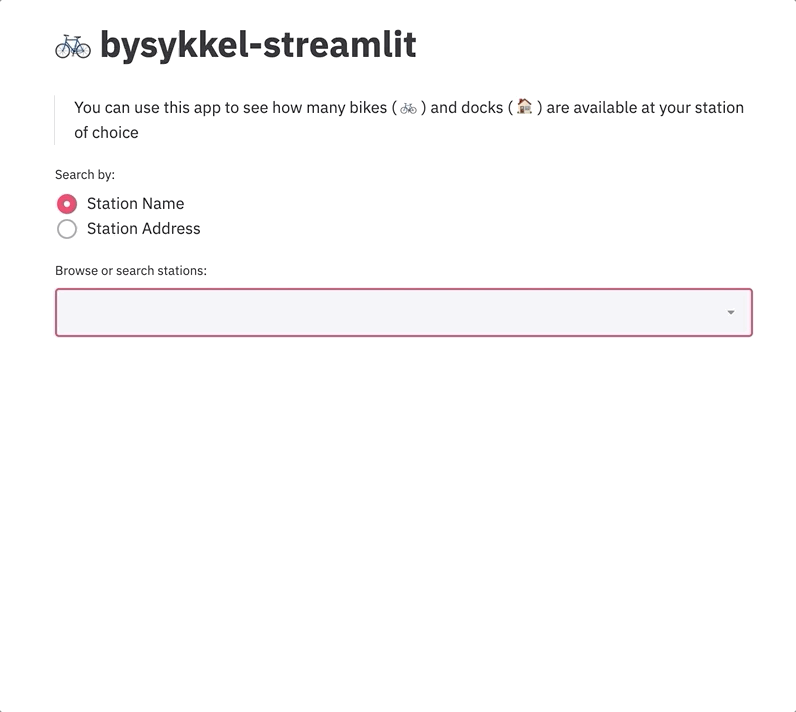

# 🚲 bysykkel-streamlit

A [Streamlit](https://github.com/streamlit/streamlit) app to check for available public bikes and docks in Oslo.

## 👷‍♂ Install

Assuming a working python 3.7 and [pipenv](https://github.com/pypa/pipenv) installation:

```
git clone https://github.com/emanlapponi/bysykkel-streamlit.git
cd bysykkel-streamlit
pipenv shell
pipenv install
```

For the pipenv-sceptical user, however, all you really need is to `pip install streamlit` wherever you cook your modern python. 

## 🏃‍♂ Run

From within the pipenv shell:

```bash
streamlit run app.py
```

The streamlit server should fire up your default browser and catapult you straight to the app.

## 💡 Use

Please refer to the gif below for instructions on how to use the app.



